# Moonshot Project - Class Diagram

## Project Overview
Moonshot is a comprehensive tool for evaluating LLM-based AI systems through benchmarking and red-teaming. It provides both Web UI and CLI interfaces for testing AI systems against various performance metrics and safety vulnerabilities.

## Architecture Class Diagram

```mermaid
classDiagram
    %% Main Application Entry Point
    class MoonshotApp {
        +main()
        +run_subprocess()
        +moonshot_data_installation()
        +moonshot_ui_installation()
        +run_moonshot_ui()
    }

    %% Core API Layer
    class API {
        +api_set_environment_variables()
    }

    %% Runner Management
    class Runner {
        -id: str
        -name: str
        -description: str
        -endpoints: list[str]
        -database_instance: DBInterface
        -database_file: str
        -progress_callback_func: Callable
        -current_operation: Any
        -current_operation_lock: asyncio.Lock
        +create(runner_args: RunnerArguments): Runner
        +load(runner_id: str): Runner
        +read(runner_id: str): RunnerArguments
        +delete(runner_id: str): bool
        +run_recipes(recipes: list[str])
        +run_cookbooks(cookbooks: list[str])
        +run_red_teaming(red_team_args: dict)
        +close()
        +cancel()
    }

    class RunnerArguments {
        +id: str
        +name: str
        +description: str
        +endpoints: list[str]
        +database_instance: DBInterface
        +database_file: str
        +progress_callback_func: Callable
    }

    class RunnerType {
        <<enumeration>>
        BENCHMARKING
        REDTEAM
    }

    %% Connector Management
    class Connector {
        <<abstract>>
        -id: str
        -endpoint: str
        -token: str
        -max_concurrency: int
        -max_calls_per_second: int
        -model: str
        -params: dict
        -rate_limiter: int
        -tokens: int
        -semaphore: asyncio.Semaphore
        -timeout: int
        -max_attempts: int
        +create(ep_args: ConnectorEndpointArguments): Connector
        +load(ep_args: ConnectorEndpointArguments): Connector
        +get_response(prompt: str): ConnectorResponse*
        +get_prediction(generated_prompt: ConnectorPromptArguments, connector: Connector): ConnectorPromptArguments
        +set_system_prompt(system_prompt: str)
        +rate_limited(func: Callable): Callable
        +perform_retry(func: Callable): Callable
    }

    class ConnectorEndpointArguments {
        +id: str
        +uri: str
        +token: str
        +max_concurrency: int
        +max_calls_per_second: int
        +model: str
        +params: dict
    }

    class ConnectorPromptArguments {
        +prompt: str
        +target: str
        +predicted_results: str
        +duration: str
        +prompt_index: int
    }

    class ConnectorResponse {
        +response: str
        +error_code: str
        +error_message: str
    }

    %% Session Management (Red Teaming)
    class Session {
        -runner_id: str
        -runner_type: RunnerType
        -runner_args: dict
        -database_instance: DBInterface
        -endpoints: list[str]
        -results_file_path: str
        -progress_callback_func: Callable
        -red_teaming_progress: RedTeamingProgress
        +load(database_instance: DBInterface): dict
        +run(): list
        +cancel()
        +update_context_strategy(db_instance: DBInterface, runner_id: str, context_strategy: str): bool
        +update_prompt_template(db_instance: DBInterface, runner_id: str, prompt_template: str): bool
        +update_attack_module(db_instance: DBInterface, runner_id: str, attack_module_id: str): bool
        +delete(database_instance: DBInterface): bool
    }

    class SessionMetadata {
        +session_id: str
        +endpoints: list[str]
        +created_epoch: float
        +created_datetime: str
        +prompt_template: str
        +context_strategy: str
        +cs_num_of_prev_prompts: int
        +attack_module: str
        +metric: str
        +system_prompt: str
        +to_dict(): dict
        +to_tuple(): tuple
        +from_tuple(data_tuple: tuple): SessionMetadata
    }

    class Chat {
        +connection_id: str
        +context_strategy: str
        +prompt_template: str
        +attack_module: str
        +metric: str
        +prompt: str
        +prepared_prompt: str
        +system_prompt: str
        +predicted_result: str
        +duration: str
        +prompt_time: str
    }

    class RedTeamingProgress {
        +current_progress: int
        +max_progress: int
        +status: RunStatus
    }

    class RedTeamingType {
        <<enumeration>>
        MANUAL
        AUTOMATED
    }

    %% Dataset Management
    class Dataset {
        +create(ds_args: DatasetArguments): str
        +convert_data(csv_file_path: str): Iterator[dict]
        +download_hf(**hf_args): Iterator[dict]
        +read(ds_id: str): DatasetArguments
        +delete(ds_id: str): bool
        +get_available_items(datasets: list[str]): tuple[list[str], list[DatasetArguments]]
    }

    class DatasetArguments {
        +id: str
        +name: str
        +description: str
        +reference: str
        +license: str
        +examples: Iterator[dict]
        +num_of_dataset_prompts: int
        +created_datetime: str
    }

    %% Recipe Management
    class Recipe {
        +create(recipe_args: RecipeArguments): str
        +read(recipe_id: str): RecipeArguments
        +update(recipe_id: str, **kwargs): RecipeArguments
        +delete(recipe_id: str): bool
        +get_available_items(): tuple[list[str], list[RecipeArguments]]
    }

    class RecipeArguments {
        +id: str
        +name: str
        +description: str
        +tags: list[str]
        +categories: list[str]
        +datasets: list[str]
        +prompt_templates: list[str]
        +metrics: list[str]
        +grading_scale: dict
        +stats: dict
    }

    %% Cookbook Management
    class Cookbook {
        +create(cookbook_args: CookbookArguments): str
        +read(cookbook_id: str): CookbookArguments
        +update(cookbook_id: str, **kwargs): CookbookArguments
        +delete(cookbook_id: str): bool
        +get_available_items(): tuple[list[str], list[CookbookArguments]]
    }

    class CookbookArguments {
        +id: str
        +name: str
        +description: str
        +recipes: list[str]
    }

    %% Metrics Management
    class Metric {
        <<abstract>>
        +get_results(prompts: list[str], predicted_results: list[str], targets: list[str]): list[float]*
        +get_available_items(): list[str]
    }

    class MetricInterface {
        <<interface>>
        +get_results(prompts: list[str], predicted_results: list[str], targets: list[str]): list[float]
    }

    %% Storage Management
    class Storage {
        +create_object(obj_type: str, obj_id: str, obj_info: dict, obj_extension: str): str
        +create_object_with_iterator(obj_type: str, obj_id: str, obj_info: dict, obj_extension: str, iterator_keys: list[str], iterator_data: Iterator[dict]): str
        +read_object(obj_type: str, obj_id: str, obj_extension: str): dict
        +read_object_with_iterator(obj_type: str, obj_id: str, obj_extension: str, json_keys: list[str], iterator_keys: list[str]): dict
        +delete_object(obj_type: str, obj_id: str, obj_extension: str): bool
        +get_objects(obj_type: str, obj_extension: str): Iterator[str]
        +create_database_connection(obj_type: str, obj_id: str, obj_extension: str): DBInterface
        +create_database_table(database_instance: DBInterface, sql_create_table: str)
        +create_database_record(database_instance: DBInterface, data: tuple, sql_create_record: str): tuple
        +read_database_records(database_instance: DBInterface, sql_read_records: str): list[tuple]
    }

    class DBInterface {
        <<interface>>
        +execute_query(query: str, params: tuple): Any
        +fetch_one(query: str, params: tuple): tuple
        +fetch_all(query: str, params: tuple): list[tuple]
        +close()
    }

    class EnvVariables {
        <<enumeration>>
        ATTACK_MODULES
        BOOKMARKS
        CONNECTORS
        CONNECTORS_ENDPOINTS
        CONTEXT_STRATEGY
        COOKBOOKS
        DATABASES
        DATASETS
        METRICS
        PROMPT_TEMPLATES
        RECIPES
        RESULTS
        RUNNERS
    }

    %% Run Management
    class Run {
        +run_id: str
        +runner_id: str
        +status: RunStatus
        +start_time: datetime
        +end_time: datetime
        +results: dict
    }

    class RunStatus {
        <<enumeration>>
        PENDING
        RUNNING
        COMPLETED
        CANCELLED
        FAILED
    }

    %% API Classes
    class APIRunner {
        +api_create_runner(name: str, endpoints: list[str]): str
        +api_load_runner(runner_id: str): Runner
        +api_get_all_runner(): list[dict]
        +api_delete_runner(runner_id: str): bool
    }

    class APISession {
        +api_create_session(runner_id: str, database_instance: Any, endpoints: list[str], runner_args: dict): Session
        +api_load_session(runner_id: str): dict
        +api_get_all_session_names(): list[str]
        +api_delete_session(runner_id: str): bool
        +api_update_context_strategy(runner_id: str, context_strategy: str): bool
        +api_update_prompt_template(runner_id: str, prompt_template: str): bool
    }

    class APIConnector {
        +api_create_connector_endpoint(connector_endpoint_args: dict): str
        +api_get_all_connector_endpoint(): list[dict]
        +api_delete_connector_endpoint(connector_endpoint_id: str): bool
    }

    class APIDataset {
        +api_create_dataset(dataset_args: dict): str
        +api_get_all_datasets(): list[dict]
        +api_delete_dataset(dataset_id: str): bool
    }

    class APIRecipe {
        +api_create_recipe(recipe_args: dict): str
        +api_get_all_recipes(): list[dict]
        +api_delete_recipe(recipe_id: str): bool
    }

    class APICookbook {
        +api_create_cookbook(cookbook_args: dict): str
        +api_get_all_cookbooks(): list[dict]
        +api_delete_cookbook(cookbook_id: str): bool
    }

    %% Relationships
    MoonshotApp --> API : uses
    
    %% Runner relationships
    Runner --> RunnerArguments : uses
    Runner --> RunnerType : has
    Runner --> DBInterface : uses
    Runner --> Session : creates
    Runner --> Connector : uses
    
    %% Session relationships
    Session --> SessionMetadata : contains
    Session --> Chat : manages
    Session --> RedTeamingProgress : tracks
    Session --> RedTeamingType : has
    Session --> DBInterface : uses
    
    %% Connector relationships
    Connector --> ConnectorEndpointArguments : configured_by
    Connector --> ConnectorPromptArguments : processes
    Connector --> ConnectorResponse : returns
    
    %% Dataset relationships
    Dataset --> DatasetArguments : uses
    
    %% Recipe relationships
    Recipe --> RecipeArguments : uses
    RecipeArguments --> Dataset : references
    RecipeArguments --> Metric : uses
    
    %% Cookbook relationships
    Cookbook --> CookbookArguments : uses
    CookbookArguments --> Recipe : contains
    
    %% Metric relationships
    Metric ..|> MetricInterface : implements
    
    %% Storage relationships
    Storage --> DBInterface : manages
    Storage --> EnvVariables : uses
    
    %% Run relationships
    Run --> RunStatus : has
    Run --> Runner : belongs_to
    
    %% API relationships
    APIRunner --> Runner : manages
    APISession --> Session : manages
    APIConnector --> Connector : manages
    APIDataset --> Dataset : manages
    APIRecipe --> Recipe : manages
    APICookbook --> Cookbook : manages
    
    %% Storage relationships
    Runner --> Storage : uses
    Session --> Storage : uses
    Dataset --> Storage : uses
    Recipe --> Storage : uses
    Cookbook --> Storage : uses
    Connector --> Storage : uses
```

## Key Components Description

### 1. **Core Application (`MoonshotApp`)**
- Main entry point for the application
- Handles installation of data and UI components
- Manages subprocess execution for different modes (Web UI, CLI)

### 2. **Runner System**
- **Runner**: Core execution engine for both benchmarking and red-teaming
- **RunnerArguments**: Configuration data for runners
- **RunnerType**: Enumeration defining execution modes

### 3. **Connector System**
- **Connector**: Abstract base class for LLM connections
- **ConnectorEndpointArguments**: Configuration for LLM endpoints
- **ConnectorPromptArguments**: Prompt processing data
- **ConnectorResponse**: Response handling from LLMs

### 4. **Session Management (Red-Teaming)**
- **Session**: Manages red-teaming sessions with chat history
- **SessionMetadata**: Stores session configuration and metadata
- **Chat**: Individual chat interactions within sessions
- **RedTeamingProgress**: Tracks progress of red-teaming operations

### 5. **Data Management**
- **Dataset**: Handles test datasets and data conversion
- **Recipe**: Defines individual test configurations
- **Cookbook**: Collections of recipes for comprehensive testing
- **Metric**: Evaluation metrics for test results

### 6. **Storage Layer**
- **Storage**: Centralized storage management
- **DBInterface**: Database abstraction layer
- **EnvVariables**: Environment configuration management

### 7. **API Layer**
- Modular API classes for each component (Runner, Session, Connector, etc.)
- Provides clean interface between storage and business logic
- Handles validation and error management

## Architecture Patterns

1. **Factory Pattern**: Used in Connector and Runner creation
2. **Strategy Pattern**: Implemented in Metrics and Context Strategies
3. **Observer Pattern**: Progress callbacks for long-running operations
4. **Repository Pattern**: Storage abstraction for data persistence
5. **Command Pattern**: API methods encapsulate operations
6. **State Pattern**: RunStatus and RedTeamingType manage execution states

## Data Flow

1. **Benchmarking Flow**: Runner → Recipe → Dataset → Connector → Metric → Results
2. **Red-Teaming Flow**: Session → Chat → Connector → Progress Tracking → Results
3. **Storage Flow**: All components → Storage → DBInterface/FileSystem

This architecture provides a flexible, modular system for LLM evaluation with clear separation of concerns and extensible design patterns. 
