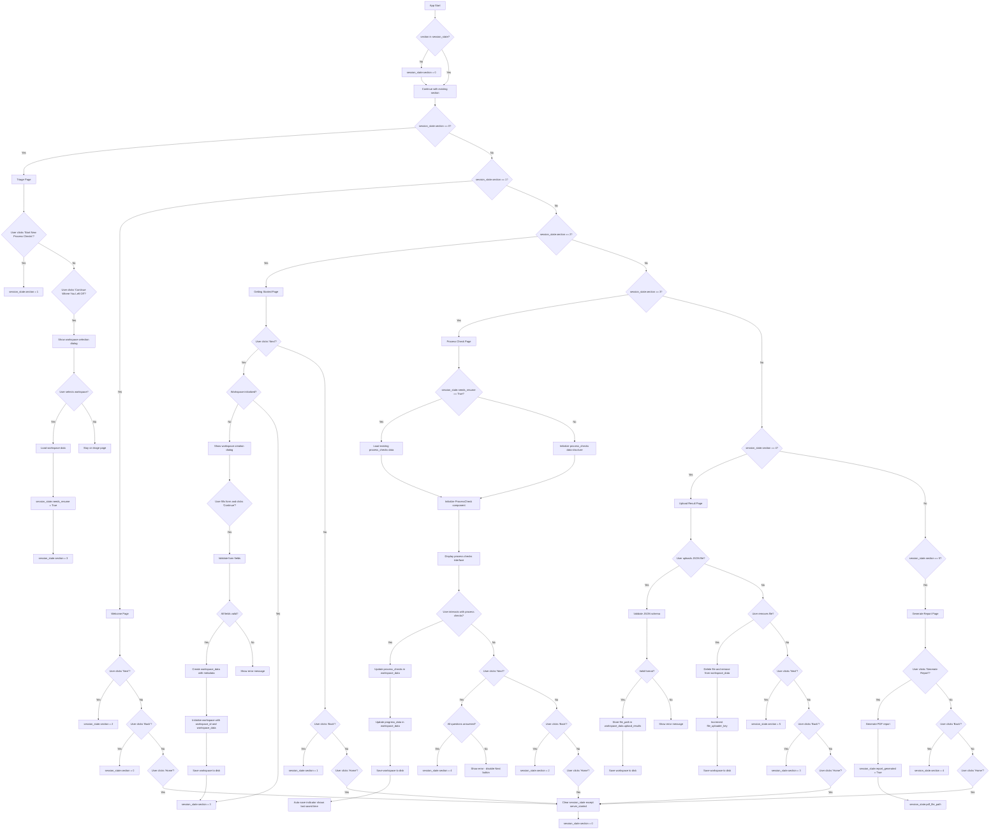

```mermaid
flowchart TD
    A[App Start] --> B{section in session_state?}
    B -->|No| C[session_state.section = 0]
    B -->|Yes| D[Continue with existing section]
    C --> D
    
    D --> E{session_state.section == 0?}
    E -->|Yes| F[Triage Page]
    E -->|No| G{session_state.section == 1?}
    G -->|Yes| H[Welcome Page]
    G -->|No| I{session_state.section == 2?}
    I -->|Yes| J[Getting Started Page]
    I -->|No| K{session_state.section == 3?}
    K -->|Yes| L[Process Check Page]
    K -->|No| M{session_state.section == 4?}
    M -->|Yes| N[Upload Result Page] 
    M -->|No| O{session_state.section == 5?}
    O -->|Yes| P[Generate Report Page]
    
    %% Triage Page Flow (section 0)
    F --> F1{User clicks 'Start New Process Checks'?}
    F1 -->|Yes| F2[session_state.section = 1]
    F1 -->|No| F3{User clicks 'Continue Where You Left Off'?}
    F3 -->|Yes| F4[Show workspace selection dialog]
    F4 --> F5{User selects workspace?}
    F5 -->|Yes| F6[Load workspace data]
    F6 --> F7[session_state.needs_resume = True]
    F7 --> F8[session_state.section = 3]
    F5 -->|No| F9[Stay on triage page]
    
    %% Welcome Page Flow (section 1)
    H --> H1{User clicks 'Next'?}
    H1 -->|Yes| H2[session_state.section = 2]
    H1 -->|No| H3{User clicks 'Back'?}
    H3 -->|Yes| H4[session_state.section = 0]
    H3 -->|No| H5{User clicks 'Home'?}
    H5 -->|Yes| H6[Clear session_state except server_started]
    H6 --> H7[session_state.section = 0]
    
    %% Getting Started Page Flow (section 2)
    J --> J1{User clicks 'Next'?}
    J1 -->|Yes| J2{Workspace initialized?}
    J2 -->|No| J3[Show workspace creation dialog]
    J3 --> J4{User fills form and clicks 'Continue'?}
    J4 -->|Yes| J5[Validate form fields]
    J5 --> J6{All fields valid?}
    J6 -->|Yes| J7[Create workspace_data with metadata]
    J7 --> J8[Initialize workspace with workspace_id and workspace_data]
    J8 --> J9[Save workspace to disk]
    J9 --> J10[session_state.section = 3]
    J6 -->|No| J11[Show error message]
    J2 -->|Yes| J10
    J1 -->|No| J12{User clicks 'Back'?}
    J12 -->|Yes| J13[session_state.section = 1]
    J12 -->|No| J14{User clicks 'Home'?}
    J14 -->|Yes| H6
    
    %% Process Check Page Flow (section 3)
    L --> L1{session_state.needs_resume == True?}
    L1 -->|Yes| L2[Load existing process_checks data]
    L1 -->|No| L3[Initialize process_checks data structure]
    L2 --> L4[Initialize ProcessCheck component]
    L3 --> L4
    L4 --> L5[Display process checks interface]
    L5 --> L6{User interacts with process checks?}
    L6 -->|Yes| L7[Update process_checks in workspace_data]
    L7 --> L8[Update progress_data in workspace_data]
    L8 --> L9[Save workspace to disk]
    L9 --> L10[Auto-save indicator shows last saved time]
    L6 -->|No| L11{User clicks 'Next'?}
    L11 -->|Yes| L12{All questions answered?}
    L12 -->|Yes| L13[session_state.section = 4]
    L12 -->|No| L14[Show error - disable Next button]
    L11 -->|No| L15{User clicks 'Back'?}
    L15 -->|Yes| L16[session_state.section = 2]
    L15 -->|No| L17{User clicks 'Home'?}
    L17 -->|Yes| H6
    
    %% Upload Result Page Flow (section 4)
    N --> N1{User uploads JSON file?}
    N1 -->|Yes| N2[Validate JSON schema]
    N2 --> N3{Valid format?}
    N3 -->|Yes| N4[Store file_path in workspace_data.upload_results]
    N4 --> N5[Save workspace to disk]
    N3 -->|No| N6[Show error message]
    N1 -->|No| N7{User removes file?}
    N7 -->|Yes| N8[Delete file and remove from workspace_data]
    N8 --> N9[Increment file_uploader_key]
    N9 --> N10[Save workspace to disk]
    N7 -->|No| N11{User clicks 'Next'?}
    N11 -->|Yes| N12[session_state.section = 5]
    N11 -->|No| N13{User clicks 'Back'?}
    N13 -->|Yes| N14[session_state.section = 3]
    N13 -->|No| N15{User clicks 'Home'?}
    N15 -->|Yes| H6
    
    %% Generate Report Page Flow (section 5)
    P --> P1{User clicks 'Generate Report'?}
    P1 -->|Yes| P2[Generate PDF report]
    P2 --> P3[session_state.report_generated = True]
    P3 --> P4[session_state.pdf_file_path]
    P1 -->|No| P5{User clicks 'Back'?}
    P5 -->|Yes| P6[session_state.section = 4]
    P5 -->|No| P7{User clicks 'Home'?}
    P7 -->|Yes| H6
```
