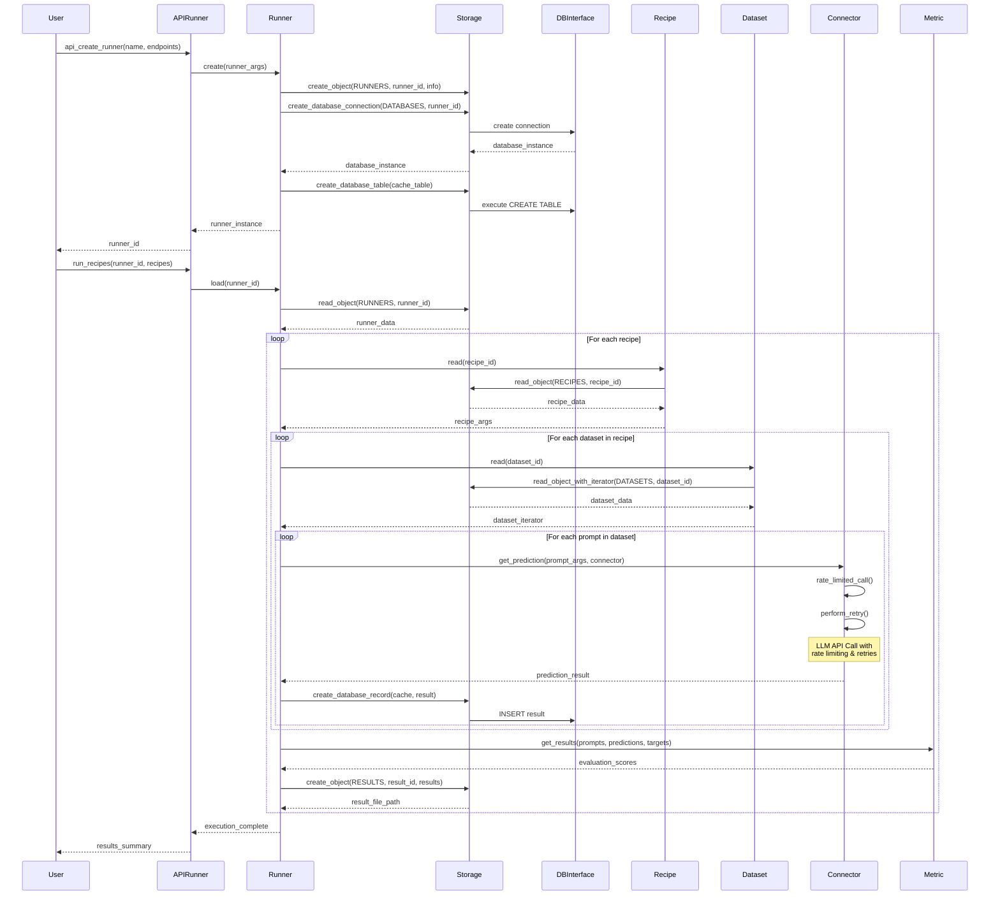
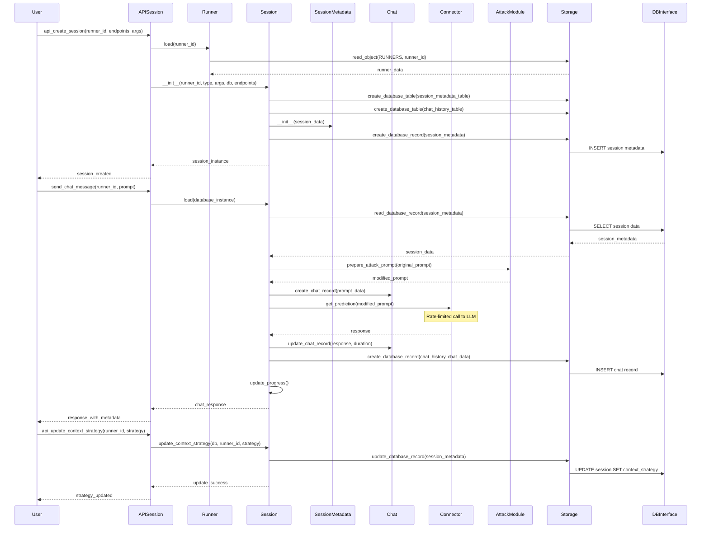
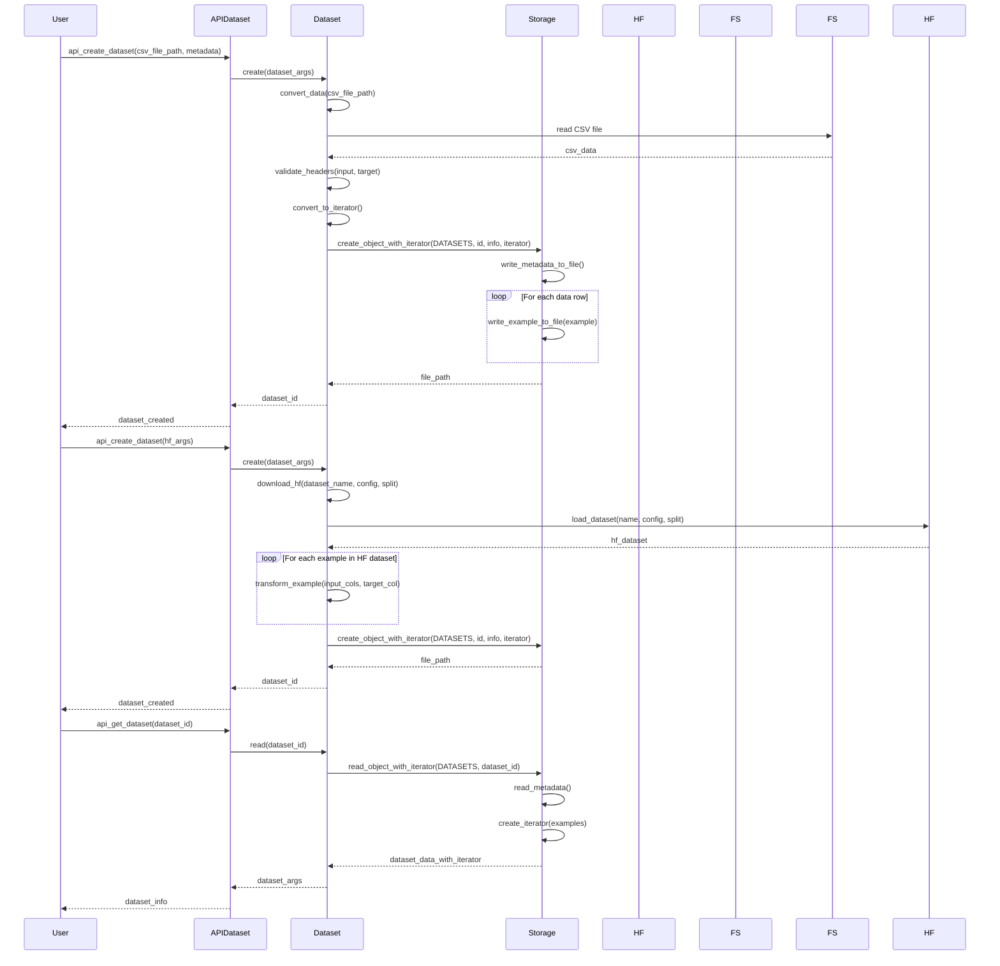
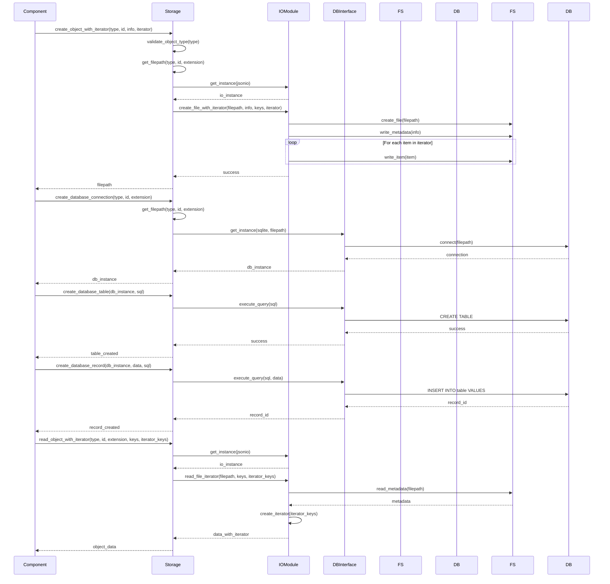
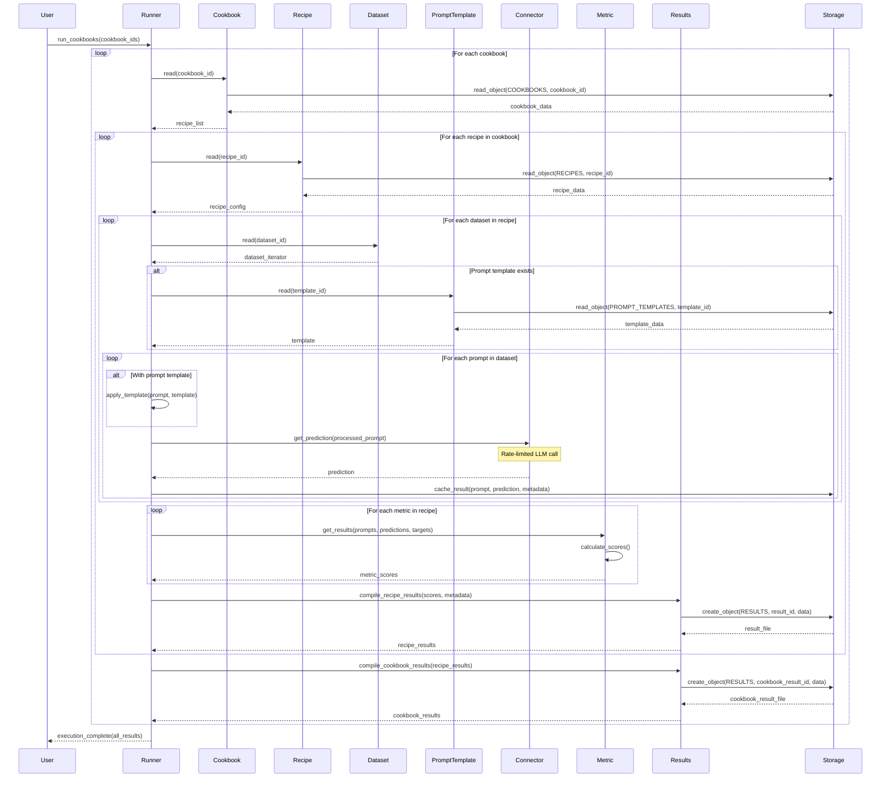

# Moonshot Project - Sequence Diagrams

## Overview
This document contains sequence diagrams for the core flows in the Moonshot project, illustrating how different components interact during key operations.

## 1. Benchmarking Flow

### Runner Creation and Recipe Execution Flow



## 2. Red-Teaming Flow

### Session Creation and Interactive Chat Flow



## 3. Dataset Management Flow

### Dataset Creation and Processing Flow



## 4. Connector Management Flow

### Connector Endpoint Creation and LLM Interaction Flow

```mermaid
sequenceDiagram
    participant User
    participant API as APIConnectorEndpoint
    participant ConnectorEndpoint
    participant Storage
    participant Connector
    participant LLM as External_LLM
    participant RateLimit as RateLimiter
    
    %% Connector Endpoint Creation
    User->>API: api_create_endpoint(name, connector_type, uri, token, model, params)
    API->>API: create ConnectorEndpointArguments(args)
    API->>ConnectorEndpoint: create(endpoint_args)
    ConnectorEndpoint->>ConnectorEndpoint: generate ep_id = slugify(name)
    ConnectorEndpoint->>Storage: create_object(CONNECTORS_ENDPOINTS, ep_id, config)
    Storage-->>ConnectorEndpoint: success
    ConnectorEndpoint-->>API: endpoint_id
    API-->>User: endpoint_created
    
    %% Connector Loading and Prediction Flow
    User->>API: get_prediction(prompt, endpoint_id)
    API->>ConnectorEndpoint: read(endpoint_id)
    ConnectorEndpoint->>Storage: read_object(CONNECTORS_ENDPOINTS, endpoint_id)
    Storage-->>ConnectorEndpoint: endpoint_config
    ConnectorEndpoint->>ConnectorEndpoint: add creation_datetime
    ConnectorEndpoint-->>API: ConnectorEndpointArguments
    
    API->>Connector: load(endpoint_args)
    Connector->>Connector: get_instance(connector_type, filepath)
    Note over Connector: Dynamic loading of<br/>connector implementation
    Connector->>Connector: __init__(endpoint_args)
    Note over Connector: Initialize rate limiter,<br/>semaphore, token bucket
    
    %% Rate Limited Prediction Call
    API->>Connector: get_prediction(prompt_args, connector)
    Connector->>Connector: @rate_limited wrapper
    Connector->>RateLimit: acquire semaphore()
    RateLimit->>RateLimit: _add_tokens() - refill bucket
    
    alt Tokens >= 1
        RateLimit->>RateLimit: consume 1 token
        RateLimit-->>Connector: proceed
    else Tokens < 1
        RateLimit->>RateLimit: calculate sleep_time = (1-tokens)/rate_limiter
        RateLimit->>RateLimit: await sleep(sleep_time)
        RateLimit->>RateLimit: _add_tokens() - refill after sleep
        RateLimit->>RateLimit: consume 1 token
        RateLimit-->>Connector: proceed
    end
    
    %% Retry Mechanism
    Connector->>Connector: @perform_retry wrapper
    
    loop Retry attempts (max_attempts from config)
        Connector->>LLM: get_response(prompt) - HTTP request
        
        alt Success Response
            LLM-->>Connector: ConnectorResponse(response, None, None)
            Connector->>Connector: log successful prediction
            break
        else API Error (Rate limit, timeout, etc.)
            LLM-->>Connector: Exception/Error
            Connector->>Connector: perform_retry_callback(connector_id, retry_state)
            Connector->>Connector: log retry attempt with error details
            
            alt Final attempt
                Connector->>Connector: raise exception
            else More attempts remaining
                Connector->>Connector: wait_random_exponential(min=1, max=60)
            end
        end
    end
    
    Connector->>Connector: record end_time and calculate duration
    Connector->>RateLimit: release semaphore()
    Connector-->>API: ConnectorPromptArguments(updated with prediction & duration)
    
    opt Prompt Callback exists
        API->>API: prompt_callback(updated_prompt_args, connector_id)
    end
    
    API-->>User: prediction_result
```

## 5. Storage Operations Flow

### File and Database Operations Flow



## 6. Recipe and Cookbook Execution Flow

### Comprehensive Testing Flow



## Flow Summary

### Key Interaction Patterns:

1. **Asynchronous Processing**: Most operations support async execution with progress callbacks
2. **Rate Limiting**: Connector interactions implement token bucket rate limiting
3. **Retry Mechanisms**: Robust error handling with exponential backoff
4. **Caching**: Results are cached in databases for performance
5. **Iterator Pattern**: Large datasets are processed using iterators to manage memory
6. **Factory Pattern**: Components are created through factory methods
7. **State Management**: Sessions and runs maintain state through database persistence

### Performance Considerations:

- **Concurrent Execution**: Multiple connectors can run in parallel with semaphore control
- **Memory Efficiency**: Large datasets use iterators instead of loading all data
- **Database Optimization**: Results are cached to avoid redundant LLM calls
- **Progress Tracking**: Long-running operations provide real-time progress updates

These sequence diagrams illustrate the sophisticated orchestration of components in the Moonshot system, showing how it manages complex workflows while maintaining performance, reliability, and extensibility. 
